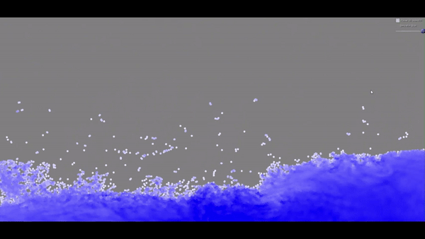
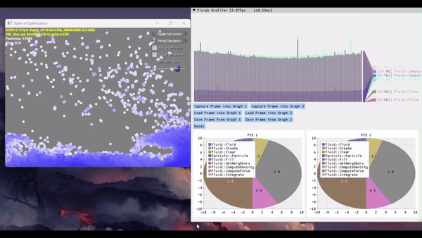

# 2D Fluid Simulation

### Project Preview

## Features 
⚡️ Navier-Stokes based simulation
⚡️ Built-in Profiler (Debug Mode)

## Installation & Deployment 📦
- Clone the repository
- Open and build using Visual Studio 2023

## Tools Used 🛠️
* <b>ImGUI</b> - Bloat-free graphical user interface library for C++

## License

- **[MIT license](http://opensource.org/licenses/mit-license.php)**

NOTE: All images used in this project are copyright-free and available for non-commercial use
